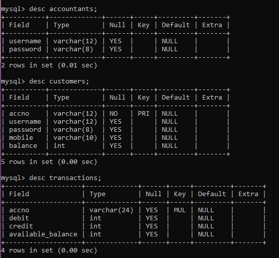

# Online-Banking-System
# Description :-
The objective of this project is to maintain the accounts like saving account, withdrawing, depositing money and applying loan to the user. Bank provides account number to the customer for dealing transactions in the bank. At first a user registers himself/herself as customer. After that account can be opened. A customer can open more than one account.

# Users of this project are :-
• Accountant  
• Customer  

# Roles of Accountant are:-
• Login using his/her username and password 
• Adding new account for customer 
• Editing already available account 
• Removing the account by using account number 
• Viewing particular account details by giving account number 
• Viewing all the account details 
• Taking care of deposit and withdrawal operations 

# Roles of Customer are 
• Login using his/her username and password 
• Transfer the money from his account to other account 
• Checking the transaction history 

# Important:- 
🚨 Forking this repo (please read!) 

This repositoty is fully Open Source, Feel free to clone this, yes you heard it right - you can fork this repo. Before that please give me a star, fork it and customize as per your wish. If you face any dificulty you can connect with me mail.dabbesaiprasad8@gmail.com. 
• This App Will use MySQL for storing Data 
• For that You must to create 3 tables in your local machine to make this App works this are follows:- 
 

• If you want to use Accountant feacture the you must have to innsert Accountant information manually in MySQL to make this App work (Basically You have to hardcore Accountants details) 

# Thank you for reading 🤗 

